# Luis Maverick Gabriel
## Lab 1: Grocery Store Inventory System

## Output
### Check Inventory (Empty)
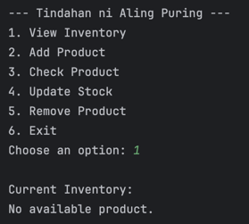

### Check Inventory (Non-Empty)
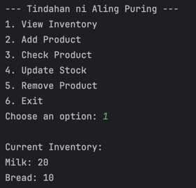

### Add Product
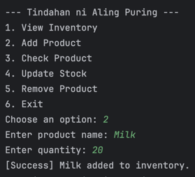

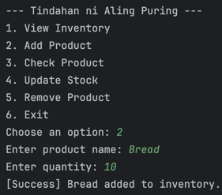

### Check Product
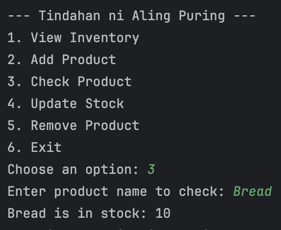

### Check Product (Does Not Exist)
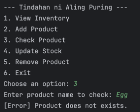

### Update Product
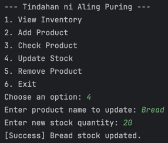

### Remove Product
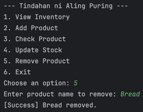

### Exit Program
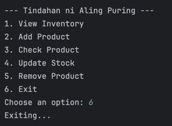

## Unit Test
### Unit Test Output
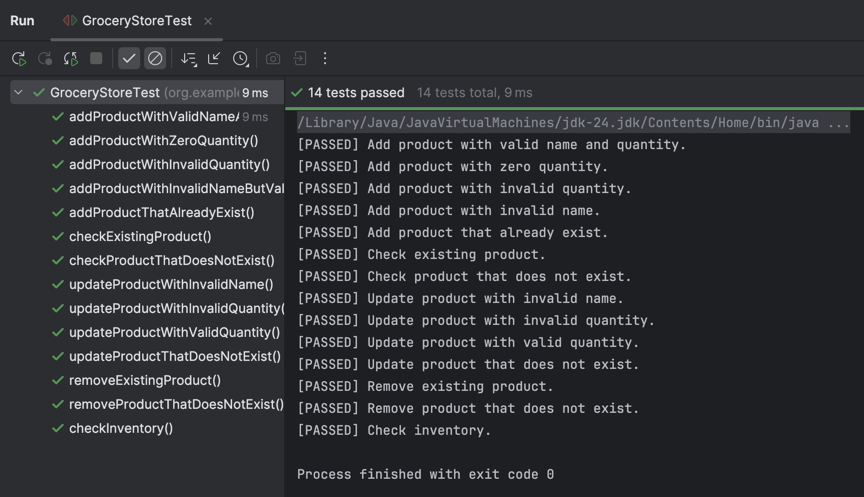

### Unit Test Coverage
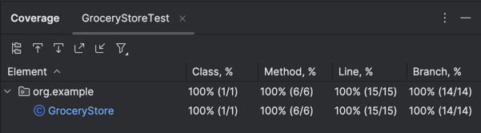
